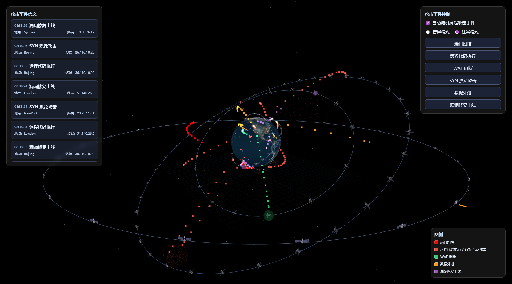
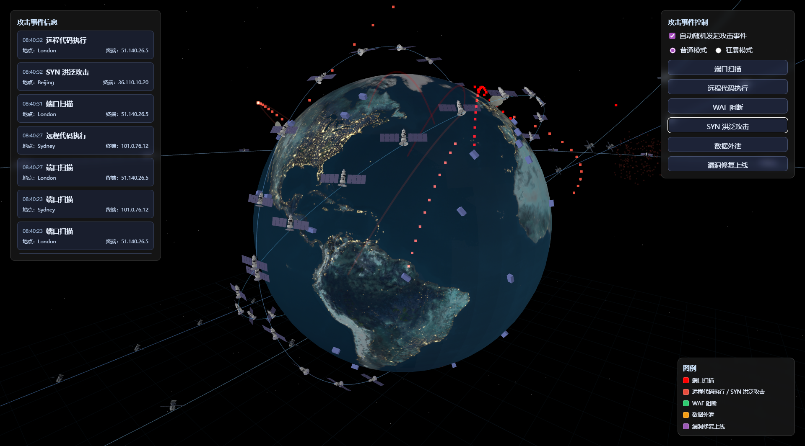

# StarAttack — 地球与卫星可视化项目

一个基于 Vue 3 + Vite + Three.js 的交互式 3D 可视化项目，展示地球与多种轨道的卫星、地面信关站和终端。项目支持加载 GLB 模型、统一缩放、真实轨道运动、粒子飞线与多种安全态势特效，并提供控制面板触发交互事件。

## 技术栈

- Vue 3（组合式 API）
- Vite（开发与构建）
- Three.js（3D 场景与渲染）
- GLTFLoader（GLB 模型加载）

## 功能概览

- 地球模型：加载 `earth.glb` 并按场景半径拟合；支持自转。
- 轨道系统：包含 GEO（同步）、高轨圆、近低轨圆、倾斜椭圆、极地圆轨道，卫星沿轨道匀速运动。
- 卫星模型：为不同轨道加载并统一缩放 GLB 模型（`SAT_VISUAL_MAX` 控制最大边尺寸）。
- 信关站与终端：挂载到地球节点，自动沿球面法线对齐并随地球自转；位置贴合球面，可微调高度。
- 粒子飞线与特效：异常流量、攻陷爆炸、防御护盾、DDoS 脉冲、数据窃取、修复光晕等，随事件动态触发。
- 控制面板：触发不同攻击/防御模式，通过事件总线与场景交互。

## 效果图






## 项目结构

```
├── public/
│   ├── earth.glb                  地球模型
│   ├── GEO_Satellite.glb          GEO/近低轨卫星模型（示例）
│   ├── High_Orbit_Satellite.glb   高轨/倾斜轨道卫星模型（示例）
│   └── Ground_zone.glb            地面信关站模型
└── src/
    ├── components/
    │   ├── ThreeScene.vue         主场景，地球/轨道/卫星/特效逻辑
    │   └── ControlPanel.vue       控制面板，触发事件
    ├── eventBus.js                事件总线
    ├── main.js                    应用入口
    └── style.css                  全局样式
```

## 快速开始

1. 安装依赖：

```
npm install
```

2. 启动开发服务器：

```
npm run dev
```

默认预览地址为 `http://localhost:5175/`。

3. 生产构建：

```
npm run build
```

## 关键配置与参数（位于 `src/components/ThreeScene.vue`）

- `WORLD_R_SCALE`：地球在场景中的半径（世界单位）。
- `SIM_SPEED`：可视化加速因子，放大时间进度以便观察运动。
- `SAT_MODEL_MAP`：轨道类型到 GLB 模型的映射。
- `SAT_VISUAL_MAX`：卫星 GLB 的统一最大边尺寸（当前为 `20`）。
- `SURFACE_OFFSET`：贴合球面外推距离（当前为 `0`，终端按半高抬起贴地）。
- 轨道数量：例如近低轨卫星数量设置为 `24`：

```js
const lowSats = createSatellitesOnCircularOrbit(lowRadius, 24, new THREE.Vector3(1,0,0), Math.PI/4, 0x55aadd)
```

## 攻击事件

场景中的安全态势通过控制面板触发“攻击事件”，每次事件会从随机终端出发，连接到最近信关站，并在终点播放对应的特效。

- 事件类型（`type`）
  - `abnormal` 异常流量：终点位置出现红色脉动光晕（持续变化的发光球）。
  - `compromise` 节点攻陷：终点位置爆炸碎片化特效，并在结束后改变节点颜色表示“已攻陷”。
  - `defense` 防御激活：终点位置生成绿色半透明防护罩，缓慢旋转。
  - `ddos` DDoS 脉冲：终点位置向外扩散的同心环，逐渐变大并淡出。
  - `exfiltration` 数据外渗：终点位置喷射粒子轨迹，带拖尾效果。
  - `patch` 漏洞修复：终点位置播放紫色修复光晕，渐变与脉动。

- 事件模式（`mode`）
  - `normal` 常规模式：适中的速度、时长与粒子密度（例如 `speed: 0.4`、`duration: 10`）。
  - `berserk` 狂暴模式：更高的速度与密度（例如 `speed: 0.75`、`duration: 12`），线宽略增。

- 触发流程
  - 控制面板发出事件：`bus.emit('attack:trigger', { type, mode })`。
  - 从现有终端中随机选择一个作为起点（`pickRandomTerminal()`）。
  - 计算最近信关站作为终点（`getNearestGateway(pos)`）。
  - 生成起点到终点的贝塞尔飞线，并沿线发射粒子（`addParticleFlowLine(...)`）。
  - 在终点播放对应事件的特效（如爆炸、护盾、光晕等）。

- 参数说明（常用）
  - `speed` 粒子沿线推进的速度，决定到达时间。
  - `duration` 飞线存活时长（秒），用于自动清理。
  - `widthPx` 线条像素宽度（视觉效果）。
  - `emissionRate` 发射粒子密度（内部参数名可能为 `emissionRate`/`emissionRateParam`）。

- 生命周期与清理
  - 飞线对象带有生命周期引用（`lineRef`），包含 `alive` 数量与 `done` 标志。
  - 到达终点后，触发一次终点特效；超过 `duration` 时，飞线与材质、几何体自动清理。

## 自定义与扩展

- 替换 GLB 模型：将新的模型文件放入 `public/` 并在 `SAT_MODEL_MAP` 中更新路径。
- 调整卫星体量：修改 `SAT_VISUAL_MAX` 控制统一尺寸；或按轨道分别设置。
- 调整密度与分布：修改各轨道的卫星数量、倾角与半径参数。
- 可视化辅助：需要始终看到全部卫星时，可添加点状覆盖标记或降低地球不透明度（用于调试）。

## 已知行为/注意事项

- 真实遮挡：靠近地球的轨道会被地球遮挡背面卫星，视角下看起来“像减少一半”；这是正常物理遮挡，可通过旋转视角或调试透明度验证。
- 性能：大量 GLB 克隆可能影响性能；如需更大规模，可采用 `InstancedMesh` 作为回退方案。

## 许可

本项目为演示用途，模型与代码仅供学习与内部使用。若外部使用，请留意相关模型与素材的版权条款。


This template should help get you started developing with Vue 3 in Vite. The template uses Vue 3 `<script setup>` SFCs, check out the [script setup docs](https://v3.vuejs.org/api/sfc-script-setup.html#sfc-script-setup) to learn more.

Learn more about IDE Support for Vue in the [Vue Docs Scaling up Guide](https://vuejs.org/guide/scaling-up/tooling.html#ide-support).
